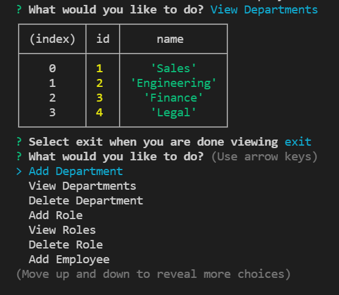

# Employee Tracker 

## Description
This is a NodeJS application that allows a user to track employees in a MySQL database. It uses the Inquirer and mysql2 packages and runs in the terminal. [The video demonstration can be viewed here.](https://drive.google.com/file/d/11BOXYFVIfetKEe6Ga7j14M53nRiXyfvN/view?usp=sharing)

## Table of Contents
* [Installation](#installation)
* [Usage](#usage)
* [License](#license)
* [Contribution](#contribution)
* [Tests](#tests)
* [Questions](#questions)

## Installation 
The application can be installed by cloning this repository. After that, you should run npm i in the root directory of the application.

## Usage 
The application can be started by running node index.js in the application root directory. You can then use the arrow keys on the keyboard to navigate through the options and select what you want to do.

## License 
Copyright zachary-berdell-elliott

Permission is hereby granted, free of charge, to any person obtaining a copy of this software and associated documentation files (the “Software”), to deal in the Software without restriction, including without limitation the rights to use, copy, modify, merge, publish, distribute, sublicense, and/or sell copies of the Software, and to permit persons to whom the Software is furnished to do so, subject to the following conditions:

  The above copyright notice and this permission notice shall be included in all copies or substantial portions of the Software.
    
  THE SOFTWARE IS PROVIDED “AS IS”, WITHOUT WARRANTY OF ANY KIND, EXPRESS OR IMPLIED, INCLUDING BUT NOT LIMITED TO THE WARRANTIES OF MERCHANTABILITY, FITNESS FOR A PARTICULAR PURPOSE AND NONINFRINGEMENT. IN NO EVENT SHALL THE AUTHORS OR COPYRIGHT HOLDERS BE LIABLE FOR ANY CLAIM, DAMAGES OR OTHER LIABILITY, WHETHER IN AN ACTION OF CONTRACT, TORT OR OTHERWISE, ARISING FROM, OUT OF OR IN CONNECTION WITH THE SOFTWARE OR THE USE OR OTHER DEALINGS IN THE SOFTWARE.

## Contribution 
The application can be contributed to by forking the repository and fixing any issues or adding features to the application. You can then merge the fork when ready

## Tests 
The application can be tested by installing it and seeding the MySQL database with the provided seeds after sourcing the the database with the schema.

## Questions 
FAQ: 

One question that gets asked is how do you login to MySQL in the command line? this can be done by running mysql -u {username} -p then entering your password. Please see the MySQL documentation for further help.

If you have any additional questions, please contact me at zacharyberdell@gmail.com to receive an answer to your question. If you would like to view other projects by me then [visit my profile here.](https://github.com/zachary-berdell-elliott)
